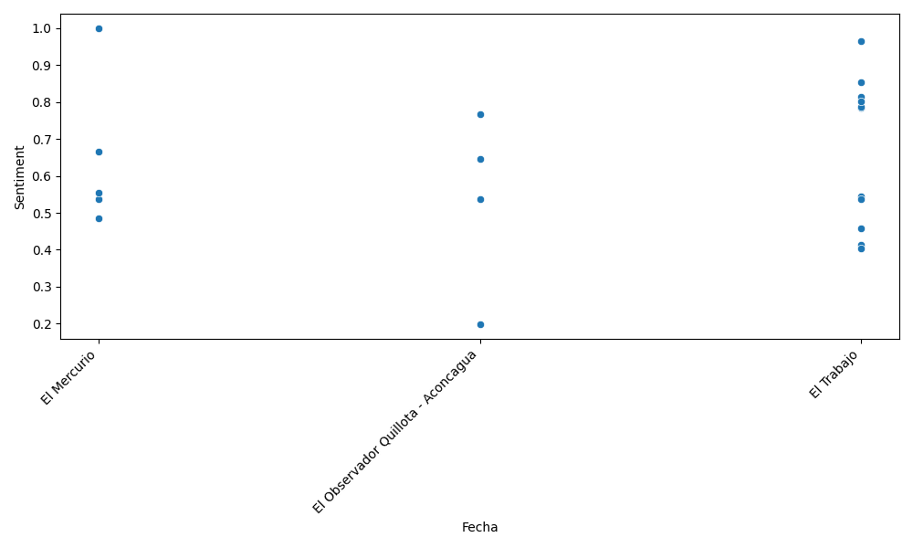

# dinamicaplataforma


## Instalación
Este código está pensado para ser clonado y luego ejecutado en un ambiente Linux. Para correr este código debe instalar el ambiente virtual para Python. Lo puede usar ejecutando el script create_venv.sh
```
. ./create_venv.sh
```

Esto instalará las dependencias que están en ```requirements.txt```
Luego de eso simplemente ejecute
```
python src/main.py data/noticias_test_ingeniero_IA.xlsx
```
Obviamente el archivo ```noticias_test_ingeniero_IA.xlsx``` debe existir. Al igual que las carpetas ```data``` y ```output```. En esta última se guardarán los resultados (plots). No lo incluí en el repositorio por si lo consideraban datos privados.


Para el análisis de sentimientos puede que debas instalar librerías extra de ```textblob```. En mi caso me pidió ejecutar ```python -m textblob.download_corpora```.


## Mini video
Grabé un pequeño video de 1 FPS durante la primera hora de trabajo. No seguí grabando porque quedaba muy pesado. Aceleré el video y el resultado quedó en ```frames_at_work.mp4```.

## Lo básico
El archivo contiene 6399 registros (filas) con 7 columnas de información que son:
- index
- titulo
- bajada
- cuerpo
- nombre_medio
- tipo_medio
- fecha
- seccion

Ya que el formato es muy poco uniforme se redujeron las categorías según:
- Agrupar (case insensitive) todos los registros de```nombre_medio``` que contengan
    - El Mercurio
    - La Tercera
    - El Austral
    - La Estrella
- Agrupar (case insensitive) todos los registros de ```seccion``` que contengan
    - Suplemento
    - Reportaje
    - Entrevista
    - Patrimonio

## Categorización por tipo de medio 
Se asumió que el número 7 correspondía a medios de alto impacto (¿quizás en formato físico?), el número 3 a los de medio impacto (¿quizás formato físico entregados por bajo costo?) y 0 a los de bajo impacto (¿formato online?). 
La distribución fue
- Tipo 7: 511
- Tipo 3: 40
- Tipo 0: 5848

En cada uno de ellos se observa una distribución exponencial decreciente. Esto quiere decir que la mayor parte de los registros están concentrados en muy pocas categorías (poco medios) y el resto esta repartido en una larga cola.


### Tipo 7
El top 3 de medios en esta categoría (conteo de registros) fue:
- El Mercurio                                            301
- La Tercera                                             109
- El Austral                                              14

Esto corresponde al (301+109+14)/511*100 = 83% de los registros. Esto es muy cercano al 80% 20% de Pareto (https://es.wikipedia.org/wiki/Eficiencia_de_Pareto).

<!--  -->


### Tipo 3
El top 3 de medios en esta categoría (conteo de registros) fue:
- El Trabajo                            12
- El Observador Quillota - Aconcagua     8
- El Mercurio                            6

Esto corresponde al (12+8+6)/40*100 = 65% de los registros.


### Tipo 0
- El Mercurio                                                      829
- La Estrella                                                      741
- El Trabajo                                                       596

Esto corresponde al (829+741+596)/5848*100 = 37% de los registros. Esto se aleja bastante de una distribución de Pareto.


## Análisis de sección

Por simplicidad siempre se tomará el top 3 de medios para el resto del análisis. La idea detrás de esto es simplificar y tratar de obtener el 80 20 de Pareto (algo que, ojo, no se alcanza en el tipo 3).

<!-- ## Tipo 7 -->

<div>
  
 
 
</div>
<center> Tipos 7, 3 y 0 respectivamente</center>


Si analizamos el tipo de secciones en que ocurrió la noticia, vemos que ciertos medios tienen más publicaciones de ciertos tipos más que de otros. Por ejemplo en el tipo 7 La Tercera soló publicó suplementos y N/A (sin sección conocida). En cambio en el tipo 0 El Mercurio publicó en todas casi las secciones disponibles.

De todos modos no vemos gran valor en esto si lo que queremos es analizar lo que sucede en Los Andes, Calle Larga, Til Til y
Colina en Chile.

## Análisis de fecha


<div>
  
 
 
</div>
<center> Tipos 7, 3 y 0 respectivamente</center>

Vemos que un pequeño porcentaje de los medios tiene registros antiguos (varios meses atrás), pero que la mayoría de los medios tiene registros actualizados. Eso quiere decir que el web scrapping funciona bien. Aunque quizás no tanto para el Tipo 3. 

## Análisis de sentimientos (positivo o negativo)

Veamos ahora que registros contienen palabras que coincidan con:
- Los Andes
- Calle Larga
- Til Til 
- Colina

Para este análisis se hizo uso de la librería ```textblob``` y la documentación de sentimientos: https://textblob.readthedocs.io/en/dev/advanced_usage.html#sentiment-analyzers

Por temas de tiempo se dejó sin traducir. Eso es un problema ya que la librería esta diseñada para el idioma Inglés. Obviamente una alternativa fácil es traducir al inglés y luego evaluar. Evidente es mejor analizar las noticias con una red entrenada en español. Pero por tiempo no alcancé y procederé a mostrar los resultados como si hubiesen sido analizados en el idioma original. 

El procesamiento tomó cerca de 1 hora. Es muy lento ya que no tengo GPU. El resultado que seleccioné es el porcentaje de apreciación positiva que tiene el texto. Está filtrado para contener los lugares que se indicaron. 


Yo uso mucho la página [Hugginface](https://huggingface.co/). En ella está este modelo: https://huggingface.co/tabularisai/multilingual-sentiment-analysis
Es multilingual y podría ser una muy buena opción. No lo he probado pero es lo siguiente que haría si tuviera más tiempo. Esta hecho en base a ```distilbert``` un modelo destilado muy conocido. Yo lo he usado para análisis semántico de imágenes. 


<div>
  
 
 
</div>
<center> Tipos 7, 3 y 0 respectivamente</center>

Como podemos ver en los resultados. En el Tipo 7, el medio El Austral cubrió de manera más positiva los lugares filtrados. Pero tuvo menos registros. En cambio, El Mercurio y La Tercera tuvieron el espectro completo de cobertura (desde muy positivas y poco positivas). 

En el tipo 3, la cobertura fue más bien con registros neutros o positivos en los tres medios top (aquellos con más registros). Es interesante observar que los diarios regionales parecerían ser más positivos en su cobertura que El Mercurio o La Tercera. 

En el tipo 0, la cobertura fue pareja en su distribución (de muy positiva a poco positiva) en los 3 medios top. Ya que tenemos tantos registros en normal que se distribuyan de esta forma. Un análisis más detallado de densidad (quartiles o de caja) queda para una segunda ocasión. 

### Evolución temporal de los sentimientos

Una de las variables más importante a estudiar lo positivo o negativo de la cobertura de las noticias es su evolución temporal. En este caso mostraremos el top 3 de medios por cada tipo (7 ,3, o 0) y el índice de 0 a 1 de cobertura positiva (0 es muy poco positivo y 1 muy positivo). El resultado es el el siguiente:


<div>
  
 
 
</div>
<center> Tipos 7, 3 y 0 respectivamente</center>


Respecto al Tipo 3 la primera observación es la poca cobertura positiva si lo comparamos con los Tipo 7 y 0. En los otros casos no es fácil observar una tendencia temporal ni hacia arriba ni abajo. Lo que haremos entonces es una análisis estadístico agrupado por rangos de fechas. Para ello utilizaremos un [gráfico de caja de seaborn](https://seaborn.pydata.org/generated/seaborn.boxplot.html). 


<div>
  
 
 
</div>
<center> Tipos 7, 3 y 0 respectivamente. Fechas ordenadas por mes. </center>

Acá se puede ver claramente en el Tipo 9 (donde hay más registros) que durante inicios de mayo hubo una tendencia hacia noticias positivas. Debemos fijarnos en el punto medio de la distribución de cajas y en particular para el medio El Mercurio (caja azul). Esto cayo notablemente el 27 de mayo, para luego repuntar gradualmente. Quizás se haya debido a algún incidente de notoriedad pública. 

Hagamos ahora el mismo análisis pero agrupado por ciudad. Esto solo tiene sentido hacerlo para el Tipo 0, ya que los demás tienen muy pocos registros como para ver tendencias. 
<!-- ### Evolución temporal de los sentimientos agrupados por ciudad -->


<div>
 
  
 
 
</div>
<center> Análisis de boxplot para Tipo 0 en Los Andres, Calle Larga, Til Til y Colina respectivamente. </center>

Acá es claro que ciertos medios tienen coberturas más positivas que otros de manera consistente a lo largo del tiempo. Til Til casi no tiene menciones. Calle Larga es muy cubierto por El Trabajo y de manera eventual por los demás medios. En el caso de Los Andes y Colina, el medio La Estrella da sistemáticamente una cobertura menos positiva que El Mercurio y El Trabajo, algo curioso. Es probable que sea un diario más pesimista o que se centre en temas de seguridad.  


## Futuros análisis posibles

Una de las posibilidades en incorporar los sentimientos negativos. Recordemos que se evalúan en dos ejes independientes. Esto es una repetición de la sección anterior, pero seleccionando otra variable de ```textblob```. 

Otra posibilidad más interesante es incorporar nuevas dimensiones (además de pos y neg) como: delincuencia, seguridad, medio ambiente, trabajo, gestión municipal/gubernamental, etc. Esto se puede lograr:
- Mezclando sentimientos pos y neg junto con palabras clave
- Modelo dedicado o entrenado para detectar estas dimensiones

Una tercera posibilidad en evaluar clasificadores en base a los registros. De nuevo, si tenemos clases específicas de noticias que queremos detectar (notas positivas, culturales) es posible entrenar clasificadores tipo Random Forest analizando el texto hasta modelos de Deep Learning como [RT-DETR](https://huggingface.co/docs/transformers/main/model_doc/rt_detr) directamente en la imagen de cada noticia (pensando en el diario LUN que es completamente gráfico). De más está decir que he entrenado ambos tipo de modelo, y más. 


Slds